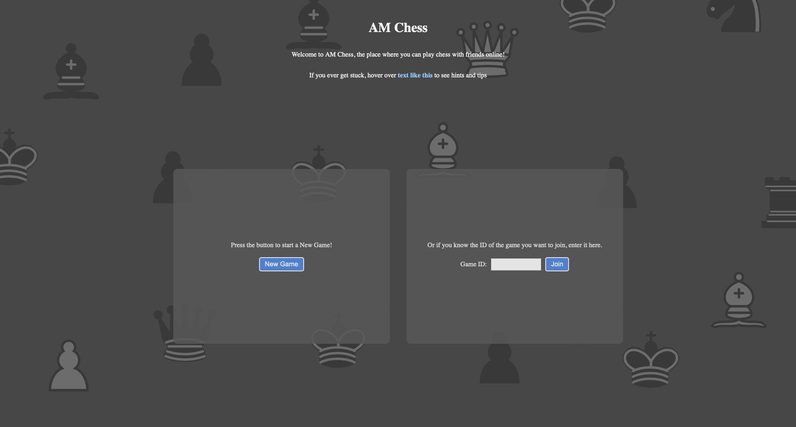

# Final-Year-Project
A Chess Web App, developed for my Final Year Project

## Requirements
- Python chess module
- Python websockets module

## Usage
1. Create a local web server to serve the web pages and files (e.g. `python -m http.server` in terminal in the folder of the application)
2. Run the python server script "main.py"
3. Open a web browser and search for the address of the web server that you created (If using the python web server, it can be accessed via 127.0.0.1:8000)

